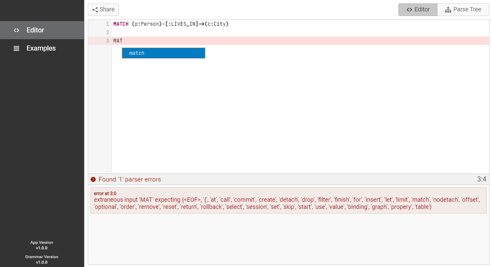
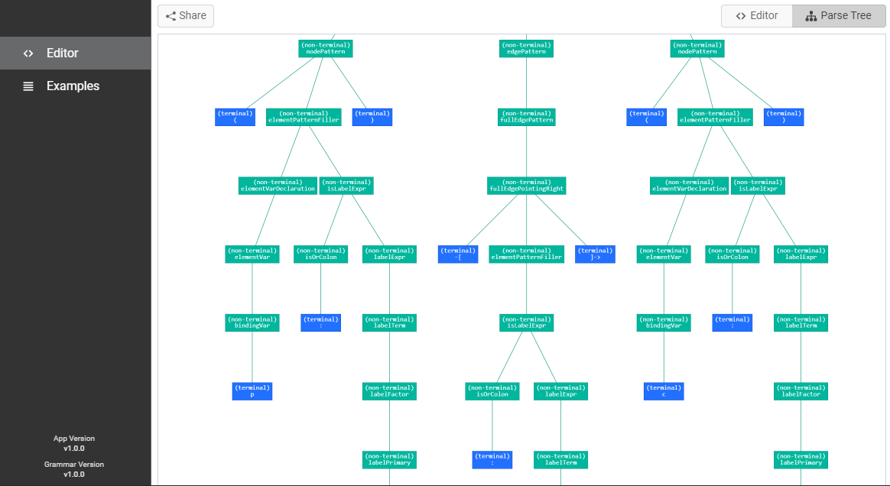

# OpenGQL Editor





### Node installation

We need to download following installer and install it in our machine:

```
https://nodejs.org/dist/v18.16.1/node-v18.16.1-x64.msi
```

After installation, we should check is Node.js installed properly by executing following command in cmd:

```
node --version
```

If everything is fine we should see currently installed version of Node, if there are some problems, probably they are related to system environment variables.

### yarn installation

**Important**
Before start this part you should have installed and verified Node.js.

Yarn is alternative package manager for Node dependencies. To install it we need to use `npm` by executing following command:

```cmd
npm install --global yarn
```

After installation, we should check is everything alright with following command:

```
yarn --version
```

Execution of that command should display the version of yarn. If Node is already installed properly there should be no problems with this installation.
